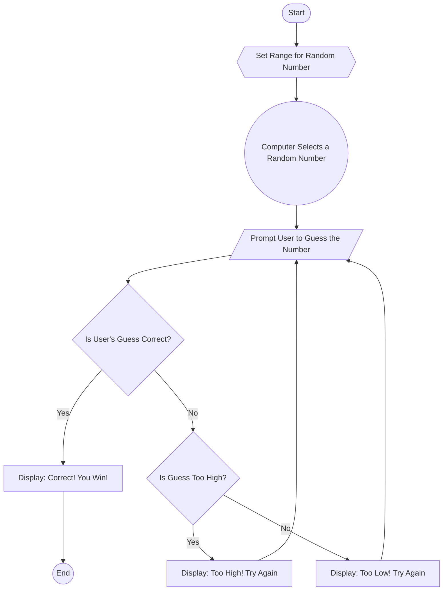

# Random Number Guessing Game Flowchart

Textual Description of Each Step
Start:

The game begins when the program is launched.
Set Range for Random Number:

The program defines the range within which the random number will be generated.
Computer Selects a Random Number:

The program generates a random number within the specified range and stores it in a variable.
Prompt User to Guess the Number:

The program prompts the user to enter their guess and stores the input.
Check if the Guess is Correct:

The program compares the user's guess with the random number:
If the guess is correct, the program displays a success message and ends the game.
If the guess is incorrect, the program checks whether the guess is too high or too low.
Determine if the Guess is Too High or Too Low:

If the guess is higher than the random number:
The program displays a message indicating the guess is too high.
The user is prompted to guess again.
If the guess is lower than the random number:
The program displays a message indicating the guess is too low.
The user is prompted to guess again.
Repeat Until Correct:

Steps 4 through 6 repeat in a loop until the user guesses the correct number.
End the Program:

Once the user guesses the correct number, the program displays a final message and terminates.
